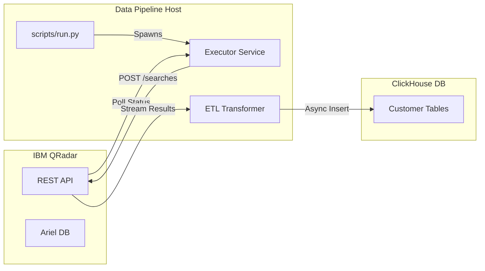

# Comprehensive Report: QRadar to ClickHouse Data Pipeline

## Table of Contents
1. [Repository Overview](#1-repository-overview)
2. [Code Review](#2-code-review)
3. [Deep Dive Evaluation](#3-deep-dive-evaluation)

---

## 1. Repository Overview

### Executive Summary
This project implements a high-performance, fault-tolerant data pipeline to extract security logs from **IBM QRadar** and ingest them into **ClickHouse**. It is designed to handle large volumes of data by leveraging **multiprocessing** for concurrent Event Processor (EP) extraction and **multithreading** for parallel customer queries.

### System Architecture

#### High-Level Data Flow
The pipeline follows a strict **Extract-Transform-Load (ETL)** pattern:

1.  **Extract**: Triggers AQL (Ariel Query Language) searches on QRadar via REST API.
2.  **Transform**: Streams JSON results, cleanses data, and maps types.
3.  **Load**: Batches transformed data and inserts it asynchronously into ClickHouse.



#### Concurrency Model
The application uses a two-tiered concurrency strategy to maximize throughput:
*   **Process Level**: A separate OS process is spawned for each **Event Processor (EP)**. This ensures that heavy data serialization/deserialization doesn't bottleneck a single GIL-bound process.
*   **Thread Level**: Within each EP process, a `ThreadPoolExecutor` manages concurrent queries for multiple **Customers**.

### Core Components Analysis

#### Entry Point & Orchestration (`scripts/run.py`)
*   **Function**: `main()` parses CLI args (`--console`, `--max-threads`) and loads configuration.
*   **Logic**:
    *   Maps console IDs (e.g., `us`, `uae`) to specific IP/Token configurations.
    *   Initializes a `multiprocessing.Pool` based on the number of Event Processors defined in `config/ep_clients.json`.
    *   Distributes work to `process_event_processor` functions.

#### Search Executor (`src/pipeline/executor.py`)
*   **Responsibility**: Manages the QRadar search lifecycle.
*   **Key Features**:
    *   **Resilience**: Uses `tenacity` for exponential backoff retries on network failures or 5xx errors.
    *   **Polling**: Implements a robust polling loop (`poll_search_status`) to wait for search completion.
    *   **Error Handling**: Specifically handles `401 Unauthorized` (fatal) vs `503 Service Unavailable` (retryable).

#### QRadar Client (`src/clients/qradar.py`)
*   **Responsibility**: Low-level HTTP interactions with QRadar.
*   **Optimization**:
    *   **Streaming**: Uses `ijson` to parse huge JSON responses incrementally without loading the entire payload into memory.
    *   **Dynamic Parsing**: Automatically detects the JSON structure (parser key) to handle varying response formats.
    *   **Safety**: Disables SSL verification warnings (common in enterprise security appliances).

#### ETL Transformer (`src/pipeline/transformer.py`)
*   **Responsibility**: Data cleansing and insertion.
*   **Workflow**:
    1.  **`extract_batches`**: Generators that yield chunks of data (default batch size from config).
    2.  **`transform_first`**: Infers schema from the first batch to create the ClickHouse table if it doesn't exist.
    3.  **`transform`**: Processes subsequent batches, handling type conversion and sanitization.
    4.  **`load`**: Uses `clickhouse_connect` to perform async bulk inserts for high performance.

### Configuration Management

Configuration is split between static JSON files and dynamic environment variables:

| File | Purpose |
| :--- | :--- |
| `.env` | Secrets (Tokens, IPs, Passwords) and global settings (Batch sizes). |
| `config/queries.json` | AQL templates. Supports placeholders like `{start_time}`. |
| `config/ep_clients.json` | Topology map defining which Customers reside on which Event Processor. |
| `config/duration.json` | Defines the time window for data extraction. |

---

## 2. Code Review

**Overall Score: 7.2/10**

### Strengths

#### Entry Point & Orchestration (`scripts/run.py`)
*   **Concurrency**: Effective use of `multiprocessing` and `ThreadPoolExecutor` to handle high-throughput requirements.
*   **Observability**: Good logging context injection (passing `customer_name`, `event_processor` to logs).

#### Search Executor (`src/pipeline/executor.py`)
*   **Robustness**: Excellent use of `tenacity` for retrying transient errors (network, 5xx).
*   **Design**: Clear distinction between triggering a search, polling for status, and handling results.
*   **Error Handling**: Specific handling for `401 Unauthorized` (stop) vs `503 Service Unavailable` (retry).

#### QRadar Client (`src/clients/qradar.py`)
*   **Efficiency**: Uses `ijson` to stream and parse large JSON responses, preventing OOM errors.
*   **Flexibility**: Clever logic to extract the parser key dynamically from the response.

#### ClickHouse Client (`src/clients/clickhouse.py`)
*   **Modern Stack**: Uses `clickhouse_connect`'s async client.

#### ETL Transformer (`src/pipeline/transformer.py`)
*   **Streaming**: Generator-based approach (`extract_batches`) fits well with the streaming nature of the QRadar client.

#### Query Builder (`src/pipeline/query_builder.py`)
*   **Logic**: Logic for splitting time ranges into chunks is sound and necessary for large queries.

#### Configuration (`src/utils/config.py` & `src/models/attributes.py`)
*   **Type Safety**: Uses `pydantic-settings` for type-safe environment variable loading.

#### Logging (`src/utils/logger.py`)
*   **Completeness**: Comprehensive logging setup using `loguru`.
*   **Integration**: Custom handler for writing logs to ClickHouse.

### Weaknesses

#### Entry Point & Orchestration (`scripts/run.py`)
*   **Coupling**: The `process_console` function relies on dynamic attribute access (`getattr(settings, f"{console_attr}_token")`). This makes the code tightly coupled to the specific field names in `Settings`.
*   **Error Masking**: The `main` function has a broad `except Exception` block. While good for preventing crashes, it might mask configuration errors during startup.

#### Search Executor (`src/pipeline/executor.py`)
*   **Complexity**: The `search_executor` function is somewhat monolithic and could be refactored into smaller, more testable units.

#### QRadar Client (`src/clients/qradar.py`)
*   **Security**: `verify=False` is hardcoded. While often necessary for internal tools, it should be configurable via an environment variable.
*   **Redundancy**: The `_make_request` method has `except Exception: raise` blocks that don't add value.

#### ClickHouse Client (`src/clients/clickhouse.py`)
*   **Performance**: `load_rows_async_using_summing_merge_tree` calls `create_async_clickhouse_client` for **every batch**. This creates and destroys a connection pool for every insert, which is highly inefficient. The client should be created once and reused.
*   **Error Handling**: Contains empty `except` blocks that just re-raise exceptions.

#### ETL Transformer (`src/pipeline/transformer.py`)
*   **Cohesion**: `ETLPipeline` mixes concerns: it handles data transformation, ClickHouse loading, and progress reporting.
*   **Duplication**: `run_first` and `run` methods share significant logic that could be unified.

#### Query Builder (`src/pipeline/query_builder.py`)
*   **Dead Code**: `get_query_size` has all keys commented out, so it defaults to "small" for everything.
*   **Rigidity**: `validate_datetime_delta` enforces a *minimum* duration of 3 hours. This prevents running short, ad-hoc queries for testing.

#### Configuration (`src/utils/config.py` & `src/models/attributes.py`)
*   **Flexibility**: The `Settings` class hardcodes fields like `console_1_ip`, `console_2_ip`. Adding a new console requires code changes. A dictionary or list of models would be more flexible.
*   **Control Flow**: `AttributeLoader` calls `sys.exit()` on error. Library code should raise exceptions and let the caller decide how to handle them.

#### Logging (`src/utils/logger.py`)
*   **Quality**: Typos like `ClickHouseclouedHandler` (should be `CloudHandler`?).
*   **Performance**: `clean_float_values` is recursive and runs on every log record, which could impact performance.
*   **Side Effects**: `modify_logger` creates directories on import/execution.

---

## 3. Deep Dive Evaluation

### Library Implementation Analysis

#### ClickHouse Connect (`src/clients/clickhouse.py`)
*   **Verdict**: **Under-engineered / Wrong Implementation**
*   **Analysis**: The implementation correctly uses the `async` capabilities of the library but fails fundamentally in resource management. Creating a new `AsyncClient` for *every single batch insertion* is a critical performance anti-pattern. It negates the benefits of connection pooling and adds significant overhead (TCP handshake, authentication) to every operation.
*   **Correction**: A singleton client or a persistent connection pool passed through the pipeline is required.

#### Tenacity (`src/pipeline/executor.py`)
*   **Verdict**: **Correctly Engineered**
*   **Analysis**: The usage of decorators for retries is idiomatic and well-implemented. The separation of retry logic for different exception types (network vs. logic errors) shows a good understanding of the library.
*   **Gap**: There is no circuit breaker pattern. If QRadar is down, the system will hammer it with retries from all threads simultaneously.

#### Pydantic (`src/utils/config.py`)
*   **Verdict**: **Under-engineered**
*   **Analysis**: While it uses Pydantic for validation, it treats the configuration as a flat list of hardcoded fields (`console_1`, `console_2`). This defeats the purpose of using a dynamic configuration library. It should use `Dict[str, ConsoleConfig]` to allow adding consoles without code changes.

#### Loguru (`src/utils/logger.py`)
*   **Verdict**: **Over-engineered**
*   **Analysis**: The recursive `clean_float_values` function running on every log record is unnecessary overhead. The custom `ClickHouseHandler` manually constructing SQL queries (`INSERT INTO ... FORMAT JSONEachRow`) is risky and reinvents the wheel; `clickhouse-connect` has built-in insert methods that handle serialization safely.

### Hidden Anti-Patterns

#### The "God Function"
*   **Location**: `src/pipeline/executor.py:search_executor`
*   **Description**: This single function handles too many responsibilities: generating params, triggering search, polling loop, error handling, and result processing. This makes it nearly impossible to unit test effectively.

#### Swallow & Re-raise
*   **Location**: Multiple files (e.g., `src/clients/clickhouse.py`, `src/clients/qradar.py`)
*   **Description**:
    ```python
    except Exception:
        raise
    ```
    This pattern appears frequently. It adds noise to the code, increases stack trace depth without adding value, and can sometimes obscure the original error context if not handled carefully.

#### Side-Effect Imports
*   **Location**: `src/utils/logger.py`
*   **Description**: The `modify_logger()` function is called at the module level (`logger = modify_logger()`). This means simply importing `src.utils.logger` will create directories on the filesystem. This is bad practice for library code and makes testing difficult (e.g., running tests in a read-only environment).

#### Hardcoded Secrets/Config in Logic
*   **Location**: `src/pipeline/query_builder.py`
*   **Description**: The `get_query_size` function contains commented-out lists of query names. This suggests that business logic (which queries are "large") is hardcoded in the source rather than driven by configuration.

### Gaps & Missing Features

*   **Circuit Breaker**: As mentioned, a global failure in QRadar will cause a retry storm.
*   **Graceful Shutdown**: There is no signal handling. If the script is killed (SIGINT/SIGTERM), in-flight batches might be lost.
*   **Dead Letter Queue (DLQ)**: Failed batches are logged but not saved to a retryable storage. If ClickHouse is down, data is lost after retries are exhausted.
*   **Metrics**: While there are logs, there are no aggregated metrics (Prometheus/StatsD) to track throughput (events/sec) or error rates in real-time.
