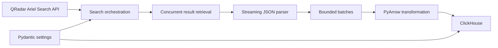

# QRadar REST API → ClickHouse Data Pipeline

A production-oriented data ingestion experiment for extracting high-volume IBM QRadar Ariel search results and loading them into ClickHouse efficiently.

The project focuses on the engineering problems that matter in real data platforms: concurrent API extraction, streamed JSON parsing, bounded-memory batching, schema-aware transformation, analytical storage, configuration management, and failure handling.

## Architecture



The repository also contains Kafka and Druid integration experiments used to explore alternate streaming and analytical sink patterns.

## Engineering highlights

### Concurrent extraction

The orchestration layer combines:

- **multiprocessing** across event processors / source partitions
- **ThreadPoolExecutor** for concurrent search execution
- isolated HTTP sessions and connector instances per process

This allows independent QRadar searches to progress concurrently instead of serialising long-running API work.

### Streaming, bounded-memory ingestion

Large Ariel result sets are requested with `stream=True` and parsed incrementally with `ijson`.

Records are accumulated only until the configured ClickHouse batch size is reached, then transformed and written before the next batch is processed.

This design avoids loading an entire API response into memory and makes the ingestion path suitable for much larger result sets than a conventional `response.json()` workflow.

### Schema-aware transformation

Incoming records are normalised before storage and converted into an Arrow representation.

The ClickHouse helper layer:

- derives column definitions from transformed data
- maps Arrow types to ClickHouse types
- creates destination tables when required
- writes analytical batches into ClickHouse

### Configuration and operational concerns

Configuration is externalised with **Pydantic Settings** rather than embedded in application logic.

The codebase also includes:

- structured logging
- explicit HTTP error propagation
- configurable batch sizing
- timeout / retry configuration hooks
- Docker Compose infrastructure for local Kafka experimentation

## Pipeline flow

1. Build the QRadar API base URLs and load search definitions.
2. Start independent workers for event processors / source partitions.
3. Execute multiple Ariel searches concurrently.
4. Retrieve completed search results as streamed HTTP responses.
5. Parse events incrementally rather than materialising the full payload.
6. Transform each bounded batch into an Arrow table.
7. Create or reuse the ClickHouse destination schema.
8. Insert batches into ClickHouse for analytical querying.

## Why this project exists

The interesting part of API ingestion is rarely the HTTP request itself.

At scale, the real problems are:

- long-running asynchronous searches
- very large responses
- API rate and latency constraints
- memory pressure
- schema conversion
- partial failures
- analytical write throughput
- concurrency without losing correctness

This repository is a practical exploration of those concerns using a security-telemetry-style workload.

## Tech stack

**Python 3.11 · Requests · ijson · PyArrow · ClickHouse · Pydantic Settings · Confluent Kafka · Docker Compose**

## Repository map

```text
.
├── qradar/          # QRadar connector, search execution and query helpers
├── clickhouse/      # ClickHouse client, schema and transformation helpers
├── mykafka/         # Kafka producer and local broker configuration
├── druid/           # Alternative analytical sink experiments
├── etl.py           # Stream → batch → transform → load path
├── run.py           # Multiprocessing + threaded orchestration
├── settings.py      # Environment-driven configuration
└── docker-compose.yml
```

## Areas I would take further for production

- idempotent checkpointing and restart semantics
- first-class retry / backoff policies around every external boundary
- contract tests for source schemas
- integration tests with containerised dependencies
- metrics for throughput, lag, failures and batch latency
- CI quality gates and reproducible local test fixtures
- explicit tenant isolation and reconciliation controls

Those are the same concerns I prioritise when designing production data platforms: **correctness, recoverability, observability, performance and cost**.
