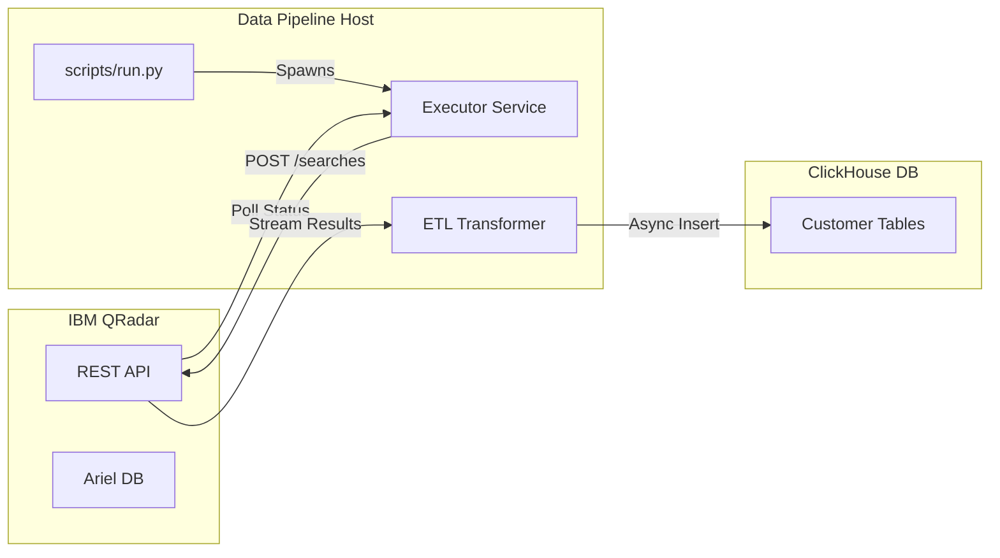

# Repository Overview: QRadar to ClickHouse Data Pipeline

## 1. Executive Summary
This project implements a high-performance, fault-tolerant data pipeline to extract security logs from **IBM QRadar** and ingest them into **ClickHouse**. It is designed to handle large volumes of data by leveraging **multiprocessing** for concurrent Event Processor (EP) extraction and **multithreading** for parallel customer queries.

## 2. System Architecture

### 2.1 High-Level Data Flow
The pipeline follows a strict **Extract-Transform-Load (ETL)** pattern:

1.  **Extract**: Triggers AQL (Ariel Query Language) searches on QRadar via REST API.
2.  **Transform**: Streams JSON results, cleanses data, and maps types.
3.  **Load**: Batches transformed data and inserts it asynchronously into ClickHouse.



### 2.2 Concurrency Model
The application uses a two-tiered concurrency strategy to maximize throughput:
*   **Process Level**: A separate OS process is spawned for each **Event Processor (EP)**. This ensures that heavy data serialization/deserialization doesn't bottleneck a single GIL-bound process.
*   **Thread Level**: Within each EP process, a `ThreadPoolExecutor` manages concurrent queries for multiple **Customers**.

## 3. Core Components Analysis

### 3.1 Entry Point & Orchestration (`scripts/run.py`)
*   **Function**: `main()` parses CLI args (`--console`, `--max-threads`) and loads configuration.
*   **Logic**:
    *   Maps console IDs (e.g., `us`, `uae`) to specific IP/Token configurations.
    *   Initializes a `multiprocessing.Pool` based on the number of Event Processors defined in `config/ep_clients.json`.
    *   Distributes work to `process_event_processor` functions.

### 3.2 Search Executor (`src/pipeline/executor.py`)
*   **Responsibility**: Manages the QRadar search lifecycle.
*   **Key Features**:
    *   **Resilience**: Uses `tenacity` for exponential backoff retries on network failures or 5xx errors.
    *   **Polling**: Implements a robust polling loop (`poll_search_status`) to wait for search completion.
    *   **Error Handling**: Specifically handles `401 Unauthorized` (fatal) vs `503 Service Unavailable` (retryable).

### 3.3 QRadar Client (`src/clients/qradar.py`)
*   **Responsibility**: Low-level HTTP interactions with QRadar.
*   **Optimization**:
    *   **Streaming**: Uses `ijson` to parse huge JSON responses incrementally without loading the entire payload into memory.
    *   **Dynamic Parsing**: Automatically detects the JSON structure (parser key) to handle varying response formats.
    *   **Safety**: Disables SSL verification warnings (common in enterprise security appliances).

### 3.4 ETL Transformer (`src/pipeline/transformer.py`)
*   **Responsibility**: Data cleansing and insertion.
*   **Workflow**:
    1.  **`extract_batches`**: Generators that yield chunks of data (default batch size from config).
    2.  **`transform_first`**: Infers schema from the first batch to create the ClickHouse table if it doesn't exist.
    3.  **`transform`**: Processes subsequent batches, handling type conversion and sanitization.
    4.  **`load`**: Uses `clickhouse_connect` to perform async bulk inserts for high performance.

## 4. Configuration Management

Configuration is split between static JSON files and dynamic environment variables:

| File | Purpose |
| :--- | :--- |
| `.env` | Secrets (Tokens, IPs, Passwords) and global settings (Batch sizes). |
| `config/queries.json` | AQL templates. Supports placeholders like `{start_time}`. |
| `config/ep_clients.json` | Topology map defining which Customers reside on which Event Processor. |
| `config/duration.json` | Defines the time window for data extraction. |

## 5. Developer Guide

### 5.1 Setup
```bash
# 1. Install dependencies
poetry install

# 2. Configure environment
cp .env.example .env
# Edit .env with your QRadar/ClickHouse credentials
```

### 5.2 Running the Pipeline
```bash
# Run for 'US' console with 5 threads per EP
python scripts/run.py --console us --max-threads 5
```

### 5.3 Adding New Queries
1.  Add the AQL query to `config/queries.json`.
2.  Ensure the query includes required columns for ClickHouse mapping.
3.  The pipeline will automatically generate a table named `{Customer}_{QueryName}`.

## 6. Error Handling & Observability
*   **Logging**: Structured logging via `src/utils/logger.py`. Logs are enriched with `request_id`, `customer_name`, and `event_processor` for traceability.
*   **Retries**: Network glitches and temporary API unavailability are handled automatically.
*   **Data Integrity**: Failed batches are logged, and the pipeline attempts to continue processing other chunks.
